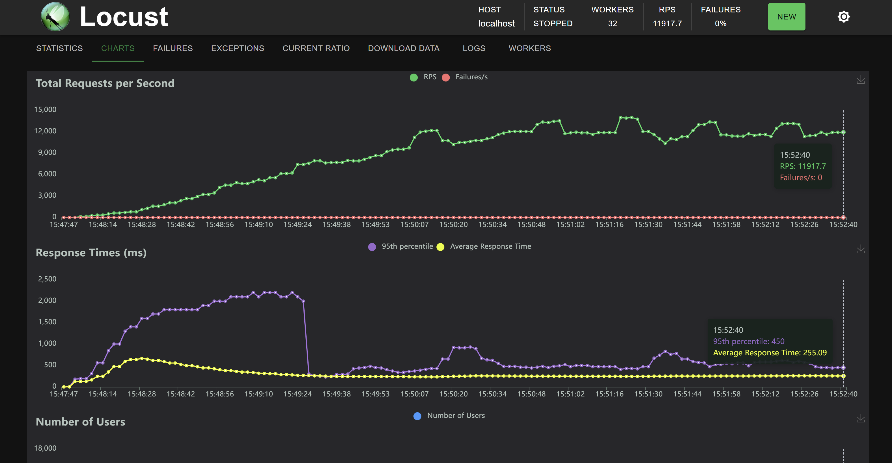

# Web-scale Data Management Project Template

Basic project structure with Python's Flask and Redis. 
**You are free to use any web framework in any language and any database you like for this project.**

### Project structure

* `env`
    Folder containing the Redis env variables for the docker-compose deployment
    
* `helm-config` 
   Helm chart values for Redis and ingress-nginx
        
* `k8s`
    Folder containing the kubernetes deployments, apps and services for the ingress, order, payment and stock services.
    
* `order`
    Folder containing the order application logic and dockerfile. 
    
* `payment`
    Folder containing the payment application logic and dockerfile. 

* `stock`
    Folder containing the stock application logic and dockerfile. 

* `test`
    Folder containing some basic correctness tests for the entire system. (Feel free to enhance them)

### Deployment types:

#### docker-compose (local development)

After coding the REST endpoint logic run `docker-compose up --build` in the base folder to test if your logic is correct
(you can use the provided tests in the `\test` folder and change them as you wish). 

***Requirements:*** You need to have docker and docker-compose installed on your machine. 

K8s is also possible, but we do not require it as part of your submission. 

#### minikube (local k8s cluster)

This setup is for local k8s testing to see if your k8s config works before deploying to the cloud. 
First deploy your database using helm by running the `deploy-charts-minicube.sh` file (in this example the DB is Redis 
but you can find any database you want in https://artifacthub.io/ and adapt the script). Then adapt the k8s configuration files in the
`\k8s` folder to mach your system and then run `kubectl apply -f .` in the k8s folder. 

***Requirements:*** You need to have minikube (with ingress enabled) and helm installed on your machine.

#### kubernetes cluster (managed k8s cluster in the cloud)

Similarly to the `minikube` deployment but run the `deploy-charts-cluster.sh` in the helm step to also install an ingress to the cluster. 

***Requirements:*** You need to have access to kubectl of a k8s cluster.

### OpenTelemetry

OpenTelemetry is an observability framework for distributed applications.
It provides three high-level components: Tracing, Metrics and Logging (although logging is not yet fully supported in Python).
Default configurations are provided for common libraries, such as Flask, Redis, etc.
These default configurations have been enabled in the stock, payment and order services and their DBs.
Use `docker-compose up --build` to start up the application.
This also starts the Aspire dashboard, which collects the telemetry data and visualizes it.
The dashboard is available on http://localhost:18888.

### Second Phase

#### Consistency and Optimistic Locking
Within each microservice, concurrency for local transactions is addressed using **Redis’s optimistic locking**. At the start of a local transaction, the application **WATCHes** the keys it intends to modify, then reads and validates them (for instance, checking sufficient funds or existing items). If, at the moment of committing (i.e., writing the new values to the database), Redis detects a conflicting update to any watched key, the transaction is immediately aborted and retried, preventing double writes.  

When a transaction fails for reasons unrelated to concurrency conflicts (e.g., insufficient stock) an error event will be sent and the orchestrator will invoke the compensatory actions if necessary.

### Performance
To improve performance and handle higher loads:
- We run **3 replicas** of each microservice.
- Each Kafka topic has **100 partitions**, in order to maximize throughput by allowing parallel consumption by each consumer group.

Below is a Locust screenshot from a local load test: with 32 locust processes running in parallel and **15k users**, the system sustains **11k–16k RPS** (requests per second). The average response time sits around **300 ms** after stabilization (results may vary based on hardware):

