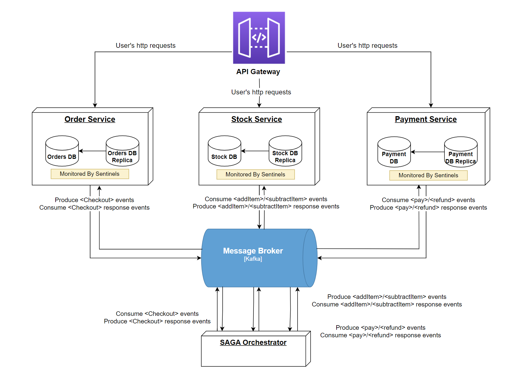

# Distributed Data System Project - Group 4

## The system
This system is designed to handle consistency, availability at scale, and also to tolerate failures. Specifically, it can tolerate multiple microservices, broker, and database instance failures and still achieve zero down-time in most scenarios. 

***Important: Do not kill the gateway***.

***Before killing any Redis master DB please check:*** [Known Issue](#known-issue)

### Architecture

- **Event-driven**: Microservices communicate by publishing and consuming events through Kafka as the message broker.

- **Saga Orchestrator**: We implemented a Saga-based approach to orchestrate distributed transactions. The orchestrator service is in charge of managing the transaction flow and triggering any necessary compensation actions in the event of failures.

### Optimistic Locking for Concurrency

Each microservice handles concurrency locally by using Redis’s optimistic locking:

1. **WATCH**: At the start of a transaction, the microservice watches the keys it intends to modify.
2. **Validation**: The service reads and checks the keys’ values to ensure, for example, that sufficient funds or stock are available.
3. **Transaction (MULTI/EXEC)**: On commit, Redis verifies whether the WATCHed keys were changed. If a conflict is detected, the transaction is aborted and then retried. If no conflict is found, the write proceeds atomically.

This mechanism prevents double writes or inconsistent updates, guaranteeing correct concurrency within each service.

### Idempotent Consumer for Consistency During Failures

In our microservices, each local transaction is processed using the Idempotent Consumer pattern combined with manual Kafka commits.
We opted for this approach even though it can lead to duplicate messages being produced. However, these duplicates translate into a single effective outcome for each transaction (thanks to the idempotency check). In practice, the end result behaves like exactly-once delivery. 

1. **Consume Event**: When the microservice reads an event from Kafka, it checks whether an idempotency key (derived from the event type and transaction ID) already exists in the database.
   
   - If **the key already exists**, it means we have already processed this event. In that case, the service simply retrieves the previous **response event** stored alongside the idempotency key in Redis and re-sends that response.

   - If **the key does not exist**, we proceed to execute the local transaction.

2. **DB Transaction**: The microservice starts an atomic Redis transaction, it computes the new changes (e.g., updating user credit, subtracting stock) and stores in the same DB transaction the new changes along with the idempotency key and the result event to send. Once the Redis transaction completes successfully, the microservice has reliably persisted both the result and the idempotency key together.

3. **Send Result Event & Commit Offset**: Finally, the microservice publishes the response event to the appropriate Kafka topic and commits the offset for the processed event in Kafka.

There are two main failure scenarios:

- **Failure before persisting the transaction result**: If the process crashes mid-transaction, no changes are committed in Redis, so the system remains consistent and the event eventually will be consumed again on Kafka (since the offset isn’t committed).

- **Failure after persisting the transaction but before committing the Kafka offset**: On restart, the same event is re-consumed, but the service will detect the existing idempotency key and skip reprocessing. It simply re-sends the existing response event.

### ⁠Kafka high availability through replication 

Our system can tolerate the failure of a single Kafka broker because we run a 3-broker cluster, with topics replicated across all three. This replication strategy ensures durability and availabilty because if one broker becomes unavailable, the other brokers continue to serve reads and writes seamlessly and no data will be lost. As a result, the system remains highly available with virtually no downtime even under node failures.

We chose to use KRaft instead of Zookeeper for managing leader elections and coordinating broker state. KRaft’s built-in consensus mechanism both speeds up failover and eliminates Zookeeper as a single point of failure, getting us closer to our goal of zero downtime in the face of broker-level failures.

### Redis high availability
The main challenge for the DB was to have it always be available. We achieved this using replications and redis sentinels. For each DB group (e.g., order), there is one master and one replica that tries to be an exact copy of the master. Synchronization in case of connection loss is handled automatically by redis. Additionally, we configured 2 sentinels that monitor the master DB's. In case the master goes down, the sentinels recognize this and elect the replica to become the new master.

In order to have all microservices always commit transactions to the master DB, they contact the DB through a sentinel, which provides them with the address of the master instance dynamically. Since at most one service can be killed in the test setup, we opted for only 2 sentinels with a quorum size of 1.

### Performance
To improve performance and handle higher loads:
- We run **3 replicas** of each microservice.
- Each Kafka topic has **3 partitions**, in order to maximize throughput by allowing parallel consumption by each consumer group.
- We switched from Flask to Quart to leverage its asynchronous capabilities, allowing non-blocking I/O and more efficient utilization of system resources. This approach also integrates well with Kafka’s asynchronous message handling.

Below is a Locust screenshot from a local load test: with 32 locust processes running in parallel and **15k users**, the system sustains **11k–16k RPS** (requests per second). The average response time sits around **300 ms** after stabilization (results may vary based on hardware):

### OpenTelemetry

OpenTelemetry was used during development to **monitor** the state of our services via **tracing**, **metrics**, and **(partial) logging**. Default OpenTelemetry configurations are provided for common libraries such as Flask and Redis, and we have enabled these defaults in the **stock**, **payment**, and **order** services (as well as their corresponding databases).

### Fault Tolerance Benchmark

We have included both consistency tests and stress tests under the `test/` directory. In addition to standard load benchmarks, we introduced basic fault-tolerance scenarios tests to see how the system behaves under failure. For step-by-step instructions on how to run these tests, please refer to the [Instructions](test/fault-tolerant-tests/user-guide_with-dynamic-killing.md). 

### Known Issue
- Before killing a master DB for testing failover, please inspect your Sentinel logs to ensure there is **no** log entry indicating **“tilt mode.”** If “tilt mode” is detected, do **not** kill the master, as it implies the Sentinel is in a passive mode and can't perform a failover. While this shouldn’t normally happen, we ask that you check the logs to avoid unexpected behavior if “tilt mode” appears, as we did't manage to find the reason behind it.

### Deployment:

#### docker-compose

After cloning the repository run `docker-compose up --build` in the base folder to build and run the system.
(wait until everything is up and running, it can take a few minutes). 

***Requirements:*** You need to have docker and docker-compose installed on your machine. 